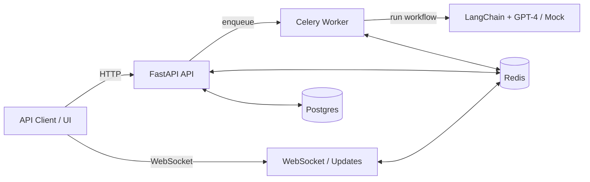

# Architecture Overview

## Key Components
- **FastAPI**: REST + WebSocket entrypoint, auth, rate limiting, readiness.
- **Celery**: async workflow execution.
- **Redis**: broker + pubsub for realtime updates.
- **Postgres**: persistence for users and task runs.
- **LangChain + GPT-4**: optional LLM; mock used if no key.
